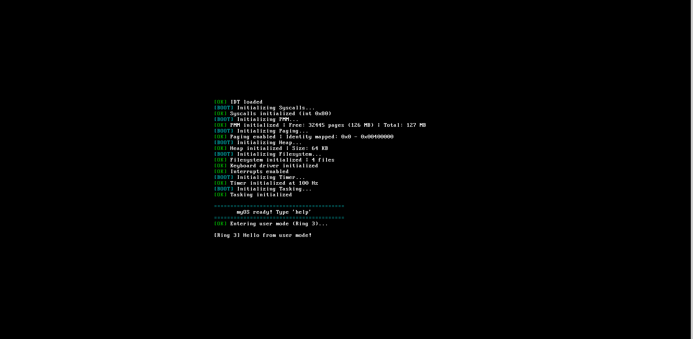

# myOS 🖥️

A hobby x86 operating system built from scratch in C and NASM assembly.
Boots on real hardware and QEMU. Implements core OS concepts from the ground up —
no libraries, no shortcuts.

---

## Demo



---

## Features

### Core Architecture
- **Bootloader** — GRUB2 Multiboot compliant
- **GDT** — Global Descriptor Table with kernel/user segments + TSS
- **IDT** — Interrupt Descriptor Table with 256 entries
- **PIC** — 8259 PIC remapped, IRQ0–IRQ15 handled

### Memory Management
- **PMM** — Physical Memory Manager with bitmap allocator (reads memory map from GRUB)
- **Heap** — `kmalloc`/`kfree` with block splitting and coalescing
- **Paging** — 32-bit page tables, 4KB pages, identity mapped first 4MB

### Multitasking
- **Preemptive Scheduler** — Round-robin, timer-driven context switching
- **Kernel Tasks** — Full task creation with isolated stacks
- **User Mode** — Ring 3 execution via `iret` privilege switch + TSS

### Drivers
- **VGA** — Text mode driver (80x25), colors, scrolling, backspace
- **Keyboard** — PS/2 scancode driver, shift, caps lock, extended keys
- **Timer** — PIT at 100Hz, uptime tracking

### System Interface
- **Syscalls** — `int 0x80` interface (sys_print, sys_exit, sys_getpid, sys_uptime)
- **ELF Loader** — Parses and loads 32-bit ELF executables from filesystem

### Filesystem & Shell
- **Ramdisk FS** — In-memory filesystem with create/read/delete
- **Interactive Shell** — Command history (↑↓), backspace, command parsing
- **Shell Commands** — `help`, `clear`, `ls`, `cat`, `write`, `rm`, `run`,
  `meminfo`, `paging`, `uptime`, `tasks`, `version`, `reboot`, `shutdown`

---

## Architecture

```text
myOS/
├── boot/
│   └── multiboot.asm            # GRUB multiboot entry point
│
├── kernel/
│   ├── kernel.c                 # Kernel main, boot sequence
│   ├── gdt.c
│   ├── gdt.h                    # Global Descriptor Table + TSS
│   ├── gdt_flush.asm            # lgdt, lidt, ltr instructions
│   ├── idt.c
│   ├── idt.h                    # Interrupt Descriptor Table
│   ├── isr.c
│   ├── isr.h                    # ISR/IRQ handlers
│   ├── isr.asm                  # Assembly stubs for interrupts
│   ├── pmm.c
│   ├── pmm.h                    # Physical Memory Manager
│   ├── heap.c
│   ├── heap.h                   # Kernel heap allocator
│   ├── paging.c
│   ├── paging.h                 # Virtual memory + page tables
│   ├── task.c
│   ├── task.h                   # Multitasking + scheduler
│   ├── syscall.c
│   ├── syscall.h                # Syscall interface
│   ├── usermode.c               # Ring 3 switch
│   ├── usermode.asm             # iret-based privilege switch
│   ├── shell.c
│   ├── shell.h                  # Interactive shell
│   ├── fs.c
│   ├── fs.h                     # Ramdisk filesystem
│   ├── elf.c
│   ├── elf.h                    # ELF binary loader
│   └── linker.ld                # Kernel linker script
│
└── drivers/
    ├── vga.c
    ├── vga.h                    # VGA text mode driver
    ├── keyboard.c
    ├── keyboard.h               # PS/2 keyboard driver
    ├── timer.c
    └── timer.h                  # PIT timer driver

---

## Building & Running

### Prerequisites
```bash
# Ubuntu/Debian (including WSL2)
sudo apt install build-essential nasm grub-pc-bin grub-common \
                 xorriso qemu-system-x86
```

### Build
```bash
git clone https://github.com/gursneh-28/myOS.git
cd myOS
make
```

### Run in QEMU
```bash
make run
```

### Controls
- **Ctrl+Alt+G** — release mouse from QEMU
- **Ctrl+Alt** — release keyboard grab

---

## Shell Commands

| Command | Description |
|---------|-------------|
| `help` | List all commands |
| `clear` | Clear the screen |
| `about` | OS info |
| `version` | Version details |
| `uptime` | Time since boot |
| `meminfo` | Physical memory + heap stats |
| `paging` | Paging/virtual memory info |
| `tasks` | List running tasks |
| `ls` | List files in filesystem |
| `cat <file>` | Print file contents |
| `write <file> <content>` | Create a file |
| `rm <file>` | Delete a file |
| `run <file.elf>` | Execute an ELF binary |
| `echo <text>` | Echo text |
| `reboot` | Restart the system |
| `shutdown` | Power off (QEMU) |

### Keyboard Shortcuts
- **↑ / ↓** — Browse command history
- **Backspace** — Delete character
- **Shift** — Uppercase / special characters
- **Caps Lock** — Toggle caps

---

## Technical Highlights

### Boot Sequence
GRUB → multiboot.asm → kernel_main()
→ GDT → IDT → Syscalls → PMM → Paging
→ Heap → Keyboard → Timer → Tasking
→ Filesystem → User mode demo → Shell

### Memory Layout
0x00000000 - 0x000FFFFF  Lower memory (reserved, BIOS)
0x00100000 - 0x003FFFFF  Kernel (loaded at 1MB by GRUB)
0x00400000+              Free for user processes
0xB8000                  VGA text buffer

### Syscall Interface
```asm
; int 0x80 calling convention
; eax = syscall number
; ebx = arg1, ecx = arg2, edx = arg3

mov eax, 0          ; SYS_PRINT
mov ebx, msg_addr   ; pointer to string
int 0x80
```

| Syscall | Number | Description |
|---------|--------|-------------|
| sys_print | 0 | Print string to VGA |
| sys_exit | 1 | Exit current task |
| sys_getpid | 2 | Get task ID |
| sys_uptime | 3 | Get seconds since boot |

### ELF Loading
run hello.elf
→ fs_open() → validate ELF magic
→ parse program headers
→ map pages (PT_LOAD segments)
→ copy segments to virtual address
→ jump to entry point

---

## What I Learned

Building myOS from scratch gave hands-on experience with:

- x86 protected mode, segmentation, and privilege rings
- Interrupt handling, PIC programming, and IRQ dispatch
- Physical and virtual memory management algorithms
- Preemptive multitasking and context switching mechanics
- ELF binary format and program loading
- Low-level C and NASM assembly co-development
- Bare-metal debugging with QEMU

---

## References

- [OSDev Wiki](https://wiki.osdev.org) — primary reference
- [Intel x86 Manual](https://www.intel.com/content/www/us/en/developer/articles/technical/intel-sdm.html)
- [NASM Documentation](https://www.nasm.us/doc/)
- James Molloy's kernel tutorial (inspiration for early structure)

---

## License

MIT License — feel free to use this as a learning reference.

---

*Built as a systems programming learning project. Not intended for production use.*